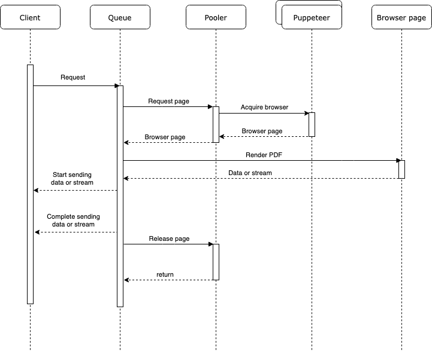

# hpdf


[](https://github.com/RichardLitt/standard-readme)


NodeJS's library for generating PDF from HTML with pool of browsers (puppeteer) in the background.

There are enough NodeJS libraries to generate PDF from HTML.
Why do you need another one?
- There is no up-to-date libraries.
- There is no libraries with pool (but we have to use pooling when we are talking about browser in the background)

### Features:
- Configurable pool of pages (as resources) in the background
- Fully tested
- Written in TypeScript

### How it works


## Table of Contents

- [Install](#install)
- [Usage](#usage)
- [Maintainers](#maintainers)
- [Contributing](#contributing)
- [License](#license)

## Install

```
npm install hpdf
```

## Usage

```typescript
import fs from 'fs';
import { PdfGenerator } from './src';

const start = async () => {
    const generator = new PdfGenerator({
        min: 3,
        max: 10,
    });

    const helloWorld = await generator.generatePDF('<html lang="html">Hello World!</html>');
    const github = await generator.generatePDF(new URL('https://github.com/frimuchkov/hpdf'));

    await fs.promises.writeFile('./helloWorld.pdf', helloWorld);
    await fs.promises.writeFile('./github.pdf', github);

    await generator.stop();
}
```

Before using puppeteer you have to install an [additional libs](https://github.com/puppeteer/puppeteer/blob/main/docs/troubleshooting.md#running-puppeteer-in-docker):
```dockerfile
FROM node:16-alpine AS base

# Installs latest Chromium (89) package.
RUN apk add --no-cache \
      chromium \
      nss \
      freetype \
      harfbuzz \
      ca-certificates \
      ttf-freefont

# Tell Puppeteer to skip installing Chrome. We'll be using the installed package.
ENV PUPPETEER_SKIP_CHROMIUM_DOWNLOAD=true \
    PUPPETEER_EXECUTABLE_PATH=/usr/bin/chromium-browser

WORKDIR /app

COPY . .

RUN npm ci
RUN npm run build
RUN npm ci --omit=dev


RUN apk add --no-cache tini
ENTRYPOINT ["/sbin/tini", "--"]
```

## Maintainers

[@frimuchkov](https://github.com/frimuchkov)

## Contributing

~~PRs accepted~~. Everything accepted. Feel free to improve everything you wish.

Small note: If editing the README, please conform to the [standard-readme](https://github.com/RichardLitt/standard-readme) specification.

## License

MIT © 2022 Andrey Frimuchkov
